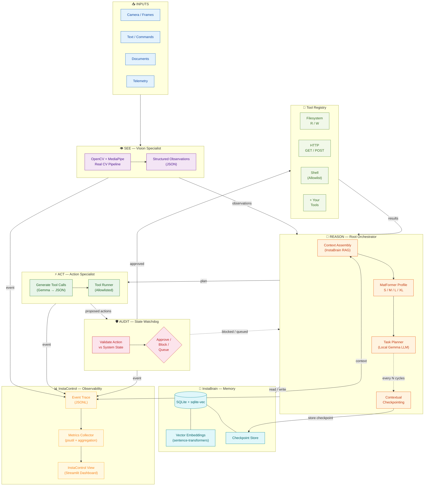

# Edge AI Agent — Architecture

## Data Flow

1. **Inputs** (camera, text, docs, telemetry) enter the **SEE** stage
2. **SEE** runs real OpenCV + MediaPipe pipelines, outputs structured JSON observations
3. **REASON** retrieves context from **InstaBrain** (RAG), selects MatFormer profile, plans via Gemma
4. **ACT** converts the plan into executable tool calls (Gemma → JSON)
5. **AUDIT** (State Watchdog) validates each action for safety/policy before execution
6. Approved actions run through the **Tool Registry** (filesystem, HTTP, shell — all allowlisted)
7. Results flow back to REASON and are stored in InstaBrain
8. **Contextual Checkpointing** periodically summarizes session state into compact checkpoints
9. **InstaControl** traces every stage as JSONL events → aggregates metrics → renders the Streamlit dashboard

## Future Extensions

- **Offline Buffer**: queue actions when connectivity drops; replay when back online
- **Local-First Escalation**: attempt local resolution before cloud fallback
- **Multi-Device Federation**: edge mesh for distributed agent coordination
- **Auto-Scaling MatFormer**: dynamically adjust granularity based on real-time CPU/RAM
- **Secure Enclave**: isolate sensitive tool execution in a sandboxed subprocess
